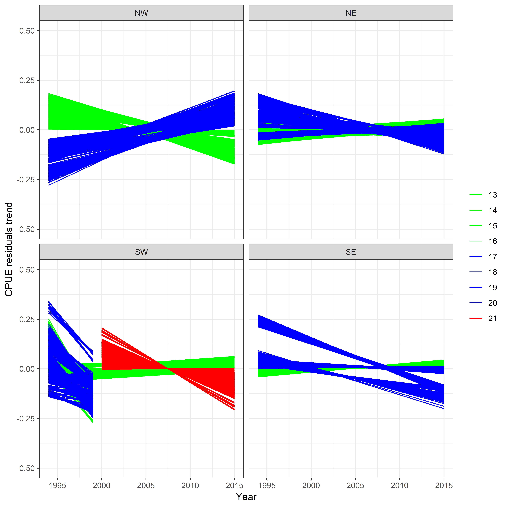
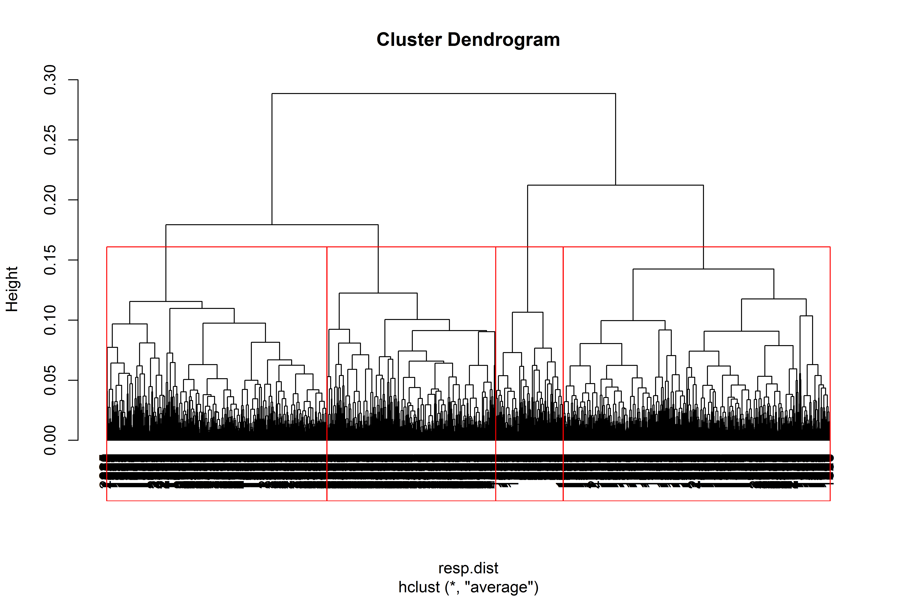
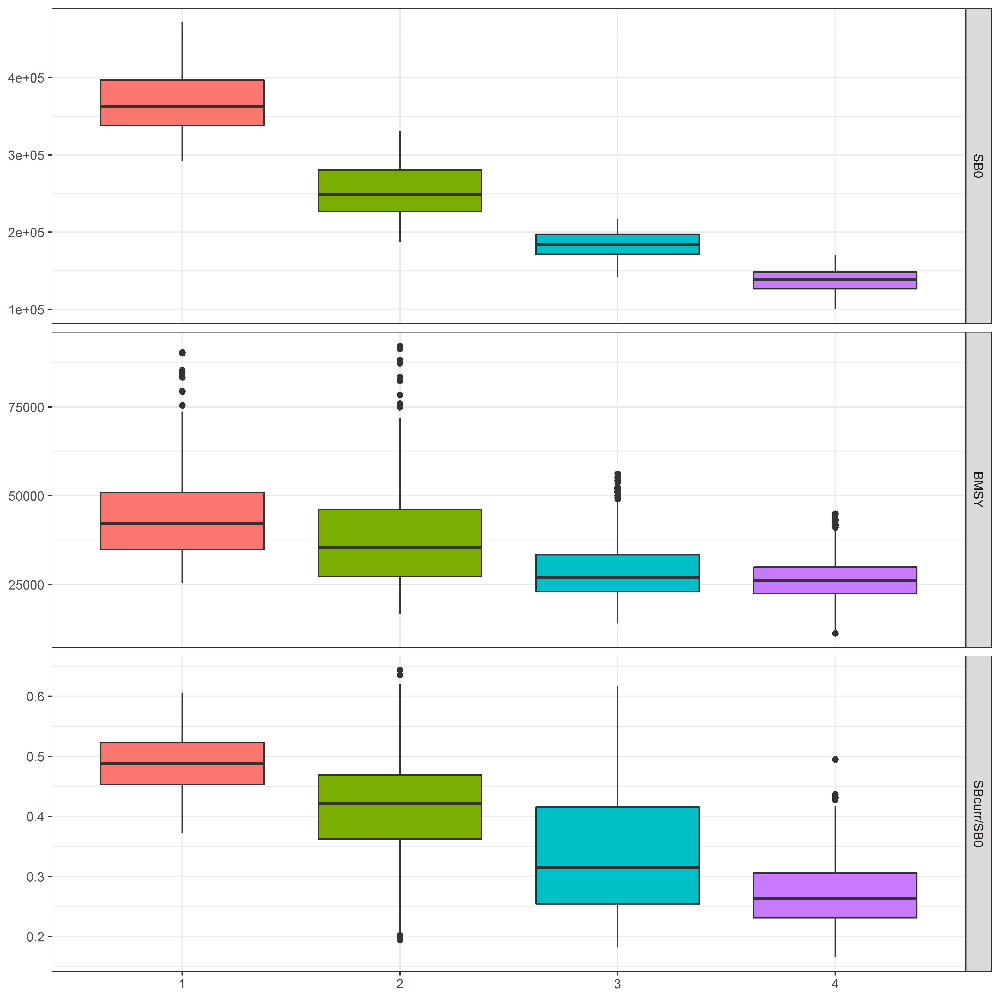

```{r, knitr, echo=FALSE, message=FALSE}
library(knitr)
opts_chunk$set(echo=FALSE, message=FALSE, warning=FALSE, cache=TRUE,
  dev="pdf", out.width = "50%", fig.pos="htbp", fig.align="center")
# opts_knit$set(root.dir = "C:/Users/USER/Desktop/SWO-MSE/Git-SWO/SWO/")
```

```{r, packages}
library(ggplot2)
library(data.table)
library(gridExtra)
library(ioswomse)
```


# Introduction

The Indian Ocean Tuna Commission (IOTC) has committed to a path of using Management Strategy Evaluation (MSE) to meet its obligations for adopting the precautionary approach. IOTC Resolution 12/01 *On the implementation of the precautionary approach* identifies the need for harvest strategies to help maintain stocks at levels consistent with the agreed reference points. Resolution 15/10, that superseded Resolution 13/10, provided a renewed mandate for the Scientific Committee to evaluate the performance of harvest control rules with respect to the species-specific interim target and limit reference points, no later than 10 years following the adoption of the reference points, for consideration of the Commission and their eventual adoption. A species-specific workplan was adopted at the 2017 IOTC meeting [@IOTC2017], outlining the steps required to adopt simulation-tested Management Procedures for the highest priority species, among them the Indian Ocean swordfish stock.

The 2017 session of the IOTC Working Party on Methods (WPM) [@WPM2017] discussed and proposed an initial set of elements likely to be responsible for most of the model uncertainty, both in past dynamics and current stock status. The structural uncertainty in the model formulation is likely to be larger than both observation and estimation uncertainty, although the relative importance of those other two sources of uncertianty should also be explored in the future.

The development of the operating model (OM) was initialized in 2017 [@Mosqueira2017SWOOM], in 2018 a 2nd workshop meeting of the authors on the development of the OM and initial testing of generic management procedures was conducted from the 5th-8th of November. The results of this workshop are presented in this document.

# Operating model

```{r data}
load("C:/Users/USER/Desktop/SWO-MSE/Git-SWO/SWO/om/out/sa.RData")
```

##Structure and assumptions

The OM being developed here is based of the population and fishery models used for the assessment of the stock status of Indian Ocean swordfish [@Fu2017], presented at the 2017 session of the Working Party on Billfish (WPB). The Stock Synthesis 3 [@Methot2013SS3] population model is age-based (with ages 0-30), separated by sex, and partitioned into four areas. Information from 12 fisheries, defined by fleet and region, was used, including length composition data for eight of them. Standardized CPUE series exist for five longline fleets across areas. For complete details of the model please refer to @Fu2017 and @WPB2017.

The stock assessment explored the uncertainty with respect to various assumptions through a grid of 162 model runs, based around three CPUE combinations plus alternarive values for growth, natural mortality, stock-recruit steepness, variance in recruitmentr deviates, and effective sample size of the length composition data. All of these elements have been incorporated in the grid developed by WPM.

A summary of the population trajectories estimated by the model used as base for the assembling of the OMN grid, `io4_NTP_h75_GaMf_r2_CL020`^[This is a four area model, with both the Japanese and Portuguese CPUEs, steepness of 0.75, slow growth, recruitment sigmaR=0.2, effective LF sample size capped at 20] can be found in Figure \ref{fig:sa}.

```{r sa, fig.cap="Population trajectories (recruitment, SSB, catch and F) estimated by the 2017 SS3 stock assessment of Indian Ocean swordfish."}
plot(sa)+facet_grid(qname~unit,scales="free_y")
```

## Structural uncertainty grid

The 2017 session of the WPM proposed an initial set of options for characterizing the structure of the uncertainty grid for generating the OM, based on a set of SS3 model runs [@WPM2017]. During the workshop meetings of the authors to start the conditioning of the OM, those were discussed. The decision was to construct a grid of model runs built around those suggested by the WPB on feasible, or at least not too extreme, values for a number of assumptions and fixed parameters in the population model. The impact of some of these elements in the model were already explored in some detail by the researchers carrying out past stock assessments [@Fu2017].

The nine factors currently considered in the structural uncertainty grid for the swordfish OM are the following:

### Selectivity

Two functions were considered for the selectivity-at-length of the CPUE fleets: the current *double normal*, in which selectivity decreases in the older ages, and a *logistic* function, in which selectivity remains flat after reaching its assymptote.

### Steepness
Steepness (h) from Beverton and Holt stock-recruitment function is often a very influential parameter which is difficult to estimate in most stock assessments. The base case SA models used *0.75*, and the other options (*0.6* and *0.9*) reflect plausible lower and higher values.

### Growth & Maturity
Growth and maturity are very important parameters in stock assessments. Swordfish exhibit a marked difference in growth between male and female, therefore sex-specific growth and maturity estimates are used in all cases. There are concerns in the age estimation of swordfish, with differences being found in the results depending on what structure is used to estimate age (fin rays or otoliths). This uncertainty also undermines the maturity by age relationship. Two growth curves and maturity estimates are considered for the OM (Figure \ref{fig:matgrow}):

- Slow growth and late maturity  (Wang et al., 2010)
- Faster growth and earlier maturity (Farley et al., 2016, from otoliths)

{width=60%}


### Natural Mortality (M)
Natural mortality is a common unknown in most stock assessment models. The base case considered in the stock assessment model was 0.2 constant for all ages, which was supplemented with an alternative value of 0.4 also constant for all ages as suggested by the WPM. After initial exploration of OM results it was clear that setting M at 0.4 would not produce plausible estimates of biomass, therefore, based on these results, the authors decided to set natural mortality to 0.3 instead of 0.4. A 3rd possibility using age-specific M values, based on the the Lorenzen equation was also included in the grid. The age specific mortality was scaled so that M at age at maturity (age 6) was 0.25. A total of 3 possibilities were therefore considered for M in this grid (Figure \ref{fig:m}):

* 0.2, constant for all ages
* 0.3, constant for all ages
* Age and sex specific values based on the Lorenzen equation


{width=55%}


### Efective Sampling Size (ESS)
Two values were used for the relative weight of length sampling data in the total likelihood, through changes in the efective sampling size parameter, of 2 and 20. This alters the relative weighting of length samples and CPUE series in informing the model about stock dynamics and the efects of fishing at length.

### CPUE series
CPUE series presented to the WPB showed conflicting trends, specially in the final years of the series. The base case considered in the assessment used the Japanese late (1994-2015) CPUEs, with the Portuguese indices from 2000-2015 being used in the Southwest area. An alternative view could be generated by using the Taiwanese CPUEs, again  in combination with those from the Portuguese fleet for the SW. A total of 3 possibilities are thus being considered for CPUE series in this model grid (Figure \ref{fig:cpues}), based on suggestions from the WPM [@WPM2017]:

* *JPNlate + EU.PRT*: Japanese CPUE (1994-2015) with indices 2000-2015 in the SW replaced by the Portuguese index,
* *JPNlate*: Japanese CPUE (1994-2015) for all areas,
* *TWN + EU.PRT*: Taiwanese CPUE (1994-2015) with indices 2000-2015 in the SW replaced by the Portuguese index.

{width=60%}


### CPUE scaling
The conducted stock assessment considered a stock with four areas. Possible alternatives considered for scaling the CPUES were also considered, noting that some options were already explored by the WPB during the stock assessment session and recomended by the WPM:

* *area* effect * surface
* *catch* by area
* *biomass* by area, as estimated from a four area model with no scaling


### Catchability increase
Two scenarios were considered for the efective catchability of the CPUE fleet. On the first one it was assumed that the fleets have not improved their ability to fish for swordfish over time, or that any increase had been captured by the CPUE standardization process (0% increase). An alternative scenario considered a 1%/year increase in catchability by correcting the CPUE index to reflect this.

### SigmaR
Two values were considered for the true variability of recruitment in the population (*sigmaR*), specifically 0.2 and 0.6, as set by the variable `SR_sigmaR` in the SS3 control file. The WPM discussed that both lower and higher options should be considered, but that a further middle value could also be added in the future (0.4) [@WPM2017]. At this stage, and in order to not increase too much the grid of model runs, only the two extremes (0.2 and 0.6) were considered for recruitment variability.

### Summary of the OM grid of uncertanties
Table 1 below summarizes the grid of uncertanties considered for the conditioning of the OM. This grid results in a total of 2,592 model runs.

Table: Summary view of the swordfish operating model grid.

| Variable                  | Values                                         |                                                             |                                                                   |
|---------------------------|------------------------------------------------|-------------------------------------------------------------|-------------------------------------------------------------------|
| Selectivity               | Double Normal                                  | Logistic                                                    |                                                                   |
| Steepness                 | 0.6                                            | 0.75                                                        | 0.9                                                               |
| Growth + Maturity         | Slow growth, late maturity (Wang et al., 2010) | Fast growth, early maturity (Farley et al., 2016, otoliths) |                                                                   |
| M                         | Low = 0.2                                      | High = 0.3                                                  | Sex-specific Lorenzen *M* (Farley et al. (2016), otoliths)        |
| ESS                       | 2                                              | 20                                                          |                                                                   |
| CPUE scaling schemes      | Area effect x Surface                          | Catch                                                       | Biomass                                                           |
| CPUEs                     | JPN late + EU.PRT                              | JPN late                                                    | TWN + EU.PRT                                                      |
| Catchability increase     | 0%                                             | 1% / year                                                   |                                                                   |


```{r results}
load("C:/Users/USER/Desktop/SWO-MSE/Git-SWO/SWO/om/out/filter_results.RData")

SB0_low <- 159445 
SB0_high <- 277605

```

##Model selection


Initial selection of models was based on convergence level. Although all models converged in the sense of obtaining the variance-covariance matrix, 256 model convergence levels were above 0.001, which has been described as an adequate threshold for model convergency. Therefore models that did not fit this criteria were excluded from further analysis.
 
Conditioning of the albacore OM had to confront the problem of runs estimating very large values of virgin biomass to explain the observed catch levels and abundance trends when the imposed model parameters led to low stock productivity. The distribution of estimates for virgin spawning biomass (SB0) in the current OM grid (Figure \ref{fig:densvb}) do not show unreasonable estimates of SB0.

```{r densvb, fig.cap="Distribution of the 2336 estimated values of virgin biomass (SB0). The red lines show the lower and higher values of SB0 returned by the stock assessment grid."}
ggplot(results, aes(SSB_Virgin)) + geom_density(fill="grey90")+
  geom_vline(xintercept=SB0_low, colour='red') +
  geom_vline(xintercept=SB0_high, colour='red') +
  xlab("SB0")+
  ylab("Density")+
  theme_bw()
```


##Base Case Operating Model


###Model Inspection

```{r results2}
# EXPLORE 

# PLOTS

plots1 <-list()
plots2 <-list()
plots3 <-list()
plots4 <-list()


for (i in colnames(results)[1:9]) {

 plots1[[i]]<- ggplot(results, aes_string(x=i, y="SSB_Virgin")) + geom_boxplot()+
               ylab("SB0")
    
 plots2[[i]] <- ggplot(results, aes_string(x=i, y="SSB15SSBMSY")) + geom_boxplot()+
                 ylab("SBcurrent/SBMSY")
  
 plots3[[i]] <- ggplot(results, aes_string(x=i, y="SSB15SSB0")) + geom_boxplot()+
                 ylab("SBcurrent/SB0")
  
 plots4[[i]]<- ggplot(results, aes_string(x=i, y="ratio")) + geom_boxplot()+
                ylab("SBMSY/SB0")
 
}

```

Filtering ou the runs that did not converge, left a total of 2336 model runs as part of the base case OM. Inspection of the effects of the different uncertanties considered were explored visually for SB0, SBcurrent/SB0, SBcurrent/SBMSY,and SBMSY/SB0  (Figures \ref{fig:boxSB0}, \ref{fig:boxSBcurrSB0}, \ref{fig:boxSBcurrSBMSY}, \ref{fig:boxSBMSYSB0}).

Estimates of SB0 were mainly impacted by the scaling by area of the CPUEs, the CPUE and shape of the selectivity function, while SBcurrent/SB0 was affected by the scaling by area of the CPUEs and the choice of CPUE. SBcurrent/SBMSY estimates were influenced by the choice of steepness,CPUE and the scaling by area of the CPUEs. SBMSY/SB0 estimates varied by steepness, mortality sometimes helped by the choice of growth and maturity schecule.

```{r boxSB0, out.width = "80%", fig.cap="Boxplot of virgin spawning biomass (SB0) for 2336 model runs, by natural mortality (M), steepness, sigmaR, effective sample size (ESS), catchability (llq), growth and maturity (growtmat), CPUE, scaling and shape of selectivity curve (llsel) options considered in the uncertainty grid."}
grid.arrange(plots1$M,plots1$steepness,plots1$sigmaR,plots1$ess,plots1$llq,
             plots1$growmat,plots1$cpue,plots1$scaling,plots1$llsel,ncol=3,nrow=3)
```

```{r boxSBcurrSB0, out.width = "80%", fig.cap="Boxplot of current spawning biomass (SBcurrent) to virgin spawning biomass (SB0) for 2336 model runs, by natural mortality (M), steepness, sigmaR, effective sample size (ESS), catchability (llq), growth and maturity (growtmat), CPUE, scaling and shape of selectivity curve (llsel) options considered in the uncertainty grid."}
grid.arrange(plots3$M,plots3$steepness,plots3$sigmaR,plots3$ess,plots3$llq,
             plots3$growmat,plots3$cpue,plots3$scaling,plots3$llsel,ncol=3,nrow=3)
```

```{r boxSBcurrSBMSY, out.width = "80%", fig.cap="Boxplot of current spawning biomass (SBcurrent) to spawning biomass at MSY (SBMSY) for 2336 model runs, by natural mortality (M), steepness, sigmaR, effective sample size (ESS), catchability (llq), growth and maturity (growtmat), CPUE, scaling and shape of selectivity curve (llsel) options considered in the uncertainty grid."}
grid.arrange(plots2$M,plots2$steepness,plots2$sigmaR,plots2$ess,plots2$llq,
             plots2$growmat,plots2$cpue,plots2$scaling,plots2$llsel,ncol=3,nrow=3)
```

```{r boxSBMSYSB0, out.width = "80%", fig.cap="Boxplot of spawning biomass at MSY (SBMSY) to virgin spawning biomass (SB0) for 2336 model runs, by natural mortality (M), steepness, sigmaR, effective sample size (ESS), catchability (llq), growth and maturity (growtmat), CPUE, scaling and shape of selectivity curve (llsel) options considered in the uncertainty grid."}
grid.arrange(plots4$M,plots4$steepness,plots4$sigmaR,plots4$ess,plots4$llq,
             plots4$growmat,plots4$cpue,plots4$scaling,plots4$llsel,ncol=3,nrow=3)
```

Additional inspection of the effects of the interactions between relevant uncertanties considered were explored visually for SB0, SBMSY/SB0, SBcurrent/SB0, and SBMSY/SB0 (Figures \ref{fig:distSB0}, \ref{fig:distSBcurrSB0}, \ref{fig:distSBcurrSBMSY}, \ref{fig:distSBMSYSB0})

```{r distSB0, out.width = "80%", fig.cap="Distribution of the 2336 estimated values of virgin biomass (SB0) by relevant factor(CPUE, scaling and shape of the selectivy curve, llsel)."}
ggplot(results, aes(SSB_Virgin)) + 
  geom_density(aes(fill=factor(cpue)),alpha=0.3)+
  facet_grid(llsel~scaling, scales="free_y") +
  xlab("SB0")+
  ylab("Density")+
  theme_bw()+
  guides(fill=guide_legend("CPUE"))
```

```{r distSBcurrSB0, out.width = "80%", fig.cap="Distribution of the 2336 estimated values of current spawning biomass (SBcurrent)/virgin spawning biomass (SB0) by relevant factor(CPUE and scaling)."}
ggplot(results, aes(x=SSB15SSB0)) +
  geom_density(aes(fill=factor(cpue)), alpha=0.3)+
  facet_grid(~scaling)+#, scales="free_y") +
  xlab("SBcurrent/SB0")+
  ylab("Density")+
  guides(fill=guide_legend("CPUE"))+
  theme_bw()
```

```{r distSBcurrSBMSY, out.width = "80%", fig.cap="Distribution of the 2336 estimated values of current spawning biomass (SBcurrent) to spawning biomass at MSY (SBMSY) by relevant factor(cpue, scaling and steepness)."}
ggplot(results, aes(x=SSB15SSBMSY)) +
  geom_density(aes(fill=factor(cpue)), alpha=0.3)+
  facet_grid(steepness~scaling)+#, scales="free_y") +
  xlab("SBcurrent/SBMSY")+
  ylab("Density")+
  guides(fill=guide_legend("CPUE"))+
  theme_bw()
```

```{r distSBMSYSB0, out.width = "80%", fig.cap="Distribution of the 2336 estimated values of spawning biomass at MSY (SBMSY) to virgin spawning biomass (SB0) by relevant factor(steepness, mortality and growth and maturity."}
ggplot(results, aes(x=ratio)) +
  geom_density(aes(fill=factor(steepness))) +
  facet_grid(M~growmat, scales="free_y") +
  xlab("SBMSY/SB0")+
  ylab("Density")+
  theme_bw()+
  guides(fill=guide_legend("Steepness"))
```

```{r results3}

load("C:/Users/USER/Desktop/SWO-MSE/Git-SWO/SWO/om/out/metrics.RData")

metrics$REC <- areaSums(metrics$REC)
metrics$SSB <- areaSums(metrics$SSB)
metrics$C <- areaSums(metrics$C)
metrics$F <- areaSums(metrics$F * metrics$B) / areaSums(metrics$B)

```

Further inspection included analysing stock-recruitment relationship residuals (Figure \ref{fig:SRres}) and CPUE residuals (Figure \ref{fig:CPUEres}). Additionally, a linear regression was fit between first and last year CPUE residuals by fleet and area (Figure \ref{fig:CPUEtrend}), to inspect trends in CPUE residuals.

```{r SRres,out.width = "60%",fig.cap="Stock-recruitment relationship residuals for the 2336 runs for Indian Ocean swordfish. The black line shows the median value, while the darker and lighter ribbons show the 50\\% and 90\\% quantiles, respectively."}

plot(residuals$sr)+theme_bw()

```


```{r CPUEres, out.width = "80%",fig.cap="CPUE residuals for the 2336 runs for Indian Ocean swordfish. The black line shows the median value, while the darker and lighter ribbons show the 50\\% and 90\\% quantiles, respectively. From top to bottom panels represent residuals for: JPLL NW, JPLL NE, JPLL SW, JPLL SE, TWLL NW, TWLL NE, TWLL SW, TWLL SE, EU.POR SW"}

plot(residuals$indices)+theme_bw()

```

{width=60%}

###Cluster analysis

A preliminary cluster analysis was performed, using hierarchical clustering with virgin spawning biomass, spawning biomass at MSY, current spawning biomass and biomass at MSY as response variables. For testing purposes, the 2336 were grouped in 4 clusters following the results of the hierarchical cluster analysis (Figure \ref{fig:dendogram}) each with 218, 862, 711, 545 runs. Virgin spawning biomass, biomass at MSY and SBcurrent/SB0 by cluster are presented in Figure \ref{fig:clusters}.

{width=65%}

{width=50%}

###Model Trajectories

The time series plot of the subsetted grid, 2336 runs, shows values for abundance and fishing mortality to be widely distributed (Figure \ref{fig:plotom}). 

```{r plotom, out.width = "80%",fig.cap="Population trajectories (recruitment, SSB, catch and F) estimated by the filtered OM grid for Indian Ocean swordfish for male and female. The black line shows the median value, while the darker and lighter ribbons show the 50\\% and 90\\% quantiles, respectively."}

plot(metrics[1:4])+geom_line(col="black")+facet_grid(qname~unit, scales="free_y")
```


<!-- #Management procedures -->

# Software Implementation

The software that has been developed for conditioning of the SS3-based OM for Indian Ocean albacore [@Mosqueira2017ALBWPM] has been extended to work on the model structure applied to swordfish. An R package, based on the FLR Project R library for quantitative fisheries science [@KellM07FLR] is being developed ^[Currently hosted at <https://github.com/iotcwpm/SWO/tree/master/ioswomse>] containing all the code for ther MSE work on this stock: condition the OM, load and inspect the results, and future projections and simulations.


# Discussion

This document has introduced the operating model for the Indian Ocean stock of swordfish conditioning and inspecting. The OM is built by introducing multiple sources of structural uncertainty to the stock assessment model conducted by WPB [@WPB2017] and based on the Stock Synthesis 3 platform [@Methot2013SS3].

For the time being, although it was not possible to run the first projections and initial testing of generic candidate management procedures, there was an advance in the exploration and validation of OM results. Exploration of model results was performed through visual exploration of the effects of input parameters in estimated virgin biomass and current stock status. Initial validation of models was performed through analysis of residual patterns in the CPUE indices and S-R relationship. This was an initial step to inspect for trends in residuals, however, in the future further checking for patterns in residuals will be attempted.

Additionally, as loading and projecting a grid of 2336 model runs has proven computationally demanding, a preliminary cluster analysis was perfomed in order to identify runs that provide similar population trajectories. By sampling from those clusters the number of runs in the OM can be reduced, while keeping the uncertainty that is present in the OM. This was a preliminary analysis that is expected to be further developed in the future.


## Next steps

Progress on the MSE work for swordfish will continue, with the limits imposed by the available time and personal resources. In brief, the short-term workplan will consist of the following tasks:

- Further validation of model results,
- Carry out a detailed revision of the code generating the grid of SS3 models,
- Compute an initial set of reference projections: constant catch and constant F,
- Compare the levels of variability due to parameter uncertainty, estimated through Markoc chain Monte Carlo (MCMC) with those arising from structural uncertainty.

Work on this MSE exercise is being carried out around a public source code repository, available at <https://github.com/iotcwpm/SWO>. As work progresses, instructions will be made available for interested parties to install the necessary R packages and explore the results.

# References
