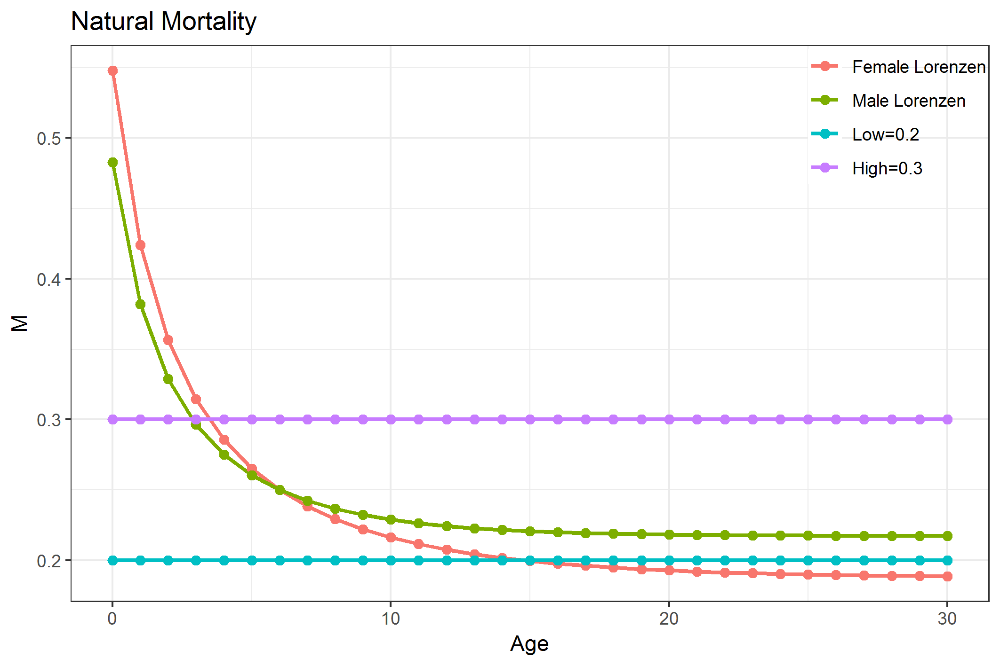
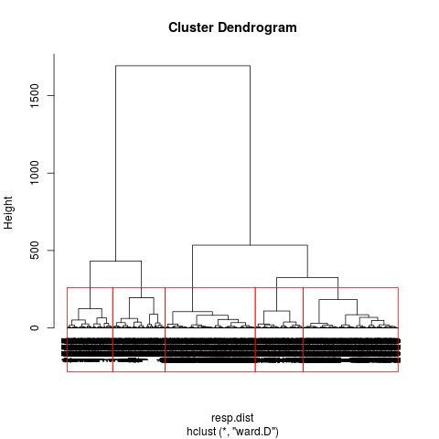
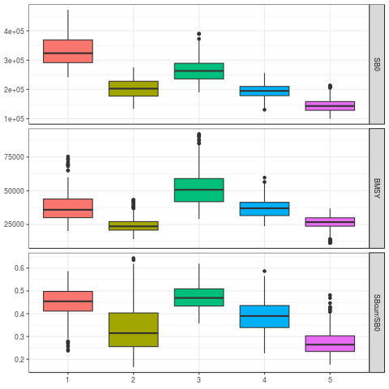
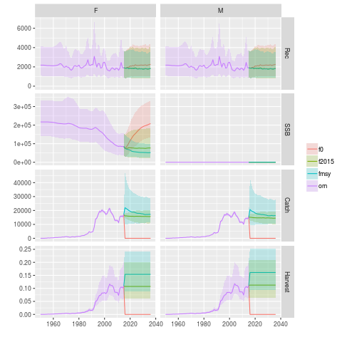
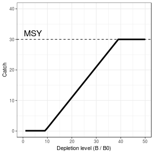
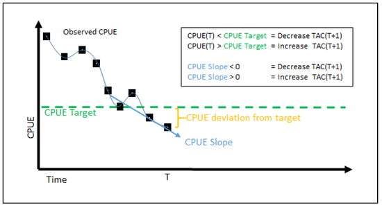

```{r, knitr, echo=FALSE, message=FALSE, warning=FALSE,, results = 'hide'}
library(knitr)
opts_chunk$set(echo=FALSE, message=FALSE, warning=FALSE, cache=TRUE,
  dev="pdf", out.width = "50%", fig.pos="htbp", fig.align="center")
opts_knit$set(root.dir = "/home/daniela/SWO")
knit_meta(class=NULL, clean = TRUE)
```


```{r, packages}
library(ggplot2)
library(data.table)
library(gridExtra)
library(ioswomse)
library(data.table)
library(mse)
library(mseviz)
library(xtable)
```


# Introduction

The Indian Ocean Tuna Commission (IOTC) has committed to a path of using Management Strategy Evaluation (MSE) to meet its obligations for adopting the precautionary approach. IOTC Resolution 12/01 *On the implementation of the precautionary approach* identifies the need for harvest strategies to help maintain stocks at levels consistent with the agreed reference points. Resolution 15/10, that superseded Resolution 13/10, provided a renewed mandate for the Scientific Committee to evaluate the performance of harvest control rules with respect to the species-specific interim target and limit reference points, no later than 10 years following the adoption of the reference points, for consideration of the Commission and their eventual adoption. A species-specific workplan was adopted at the 2017 IOTC meeting [@IOTC2017], outlining the steps required to adopt simulation-tested Management Procedures for the highest priority species, among them the Indian Ocean swordfish stock.

The 2017 session of the IOTC Working Party on Methods (WPM) [@WPM2017] discussed and proposed an initial set of elements likely to be responsible for most of the model uncertainty, both in past dynamics and current stock status. The structural uncertainty in the model formulation is likely to be larger than both observation and estimation uncertainty, although the relative importance of those other two sources of uncertianty should also be explored in the future.

The development of the operating model (OM) was initialized in 2017 [@Mosqueira2017SWOOM], continued in 2018 (@Rosa2018SWOOM) and now initial testing for candidate management procedures was started.

# Operating model

```{r data}
load("om/out/sa.RData")
load("om/out/metrics.RData")

#setting up factors
results[, (colnames(results)[1:9]) := lapply(.SD, factor), .SDcols = colnames(results)[1:9]]

results[M==999, M:="lorenzen"]
results[, M:=as.factor(as.character(M))]

#Creating status variables
results[,c("ratio","SSB15SSB0","SSB15SSBMSY"):=list(SSB_MSY/SSB_Virgin,SSB_endyr/SSB_Virgin,SSB_endyr/SSB_MSY)]

#Creating proportions for plots by cluster
tot <-lapply(c(1:5), function(x) lapply(results[cl==x,1:9],length)) 
clst <- lapply(c(1:5), function(x) lapply(results[cl==x,1:9],table))

fin<-mapply(function(x,y) mapply(function(a,b) a/b, a=x,b=y), x=clst, y=tot, SIMPLIFY=FALSE)

final <- as.data.frame(do.call(rbind, lapply(fin, Reduce, f=c)))
final$clst <- rownames(final)
colnames(final)[c(1,4)] <- c("0.20","0.60")
final <- as.data.table(melt(final, id.vars="clst"))
final[,Factor:=rep(colnames(results)[1:9],c(15,15,10,10,10,10,15,15,10))]
final[,Factor:= factor(Factor, levels=c("M", "steepness","scaling", "cpue",
                                        "sigmaR","growmat","ess","llq","llsel"))]

#Creating frequency for plots for subset by cluster
res_sub <- results[sample==T,]
clres <- lapply(c(1:5), function(x) lapply(res_sub[cl==x,1:9],table))

clres <- as.data.frame(do.call(rbind, lapply(clres, Reduce, f=c)))
clres$clst <- rownames(clres)
colnames(clres)[c(1,4)] <- c("0.20","0.60")
clres <- as.data.table(melt(clres, id.vars="clst"))
clres[,Factor:=rep(colnames(res_sub)[1:9],c(15,15,10,10,10,10,15,15,10))]
clres[,Factor:= factor(Factor, levels=c("M", "steepness","scaling", "cpue",
                                        "sigmaR","growmat","ess","llq","llsel"))]
#Inspection plots
metrics$F <- areaSums(metrics$F * metrics$B) / areaSums(metrics$B)
metrics$REC <- areaSums(metrics$REC)
metrics$SSB <- areaSums(metrics$SSB)
metrics$C <- areaSums(metrics$C)

res_sample <- rbind(results, results[results$sample==T,])
res_sample [, subset:=c(rep("Total",dim(results)[1]),rep("Subset",dim(results[results$sample==T,])[1]))]

resid_samp_sr <- iter(residuals$sr, results[results$sample==TRUE,]$iter)

resid_ind_samp <- iter(residuals$indices, results[results$sample==TRUE,]$iter)

#metrics for subset OM
metrics_sample <- iter(metrics, results[results$sample==TRUE,]$iter)

#loading performance
load("runs/out/perf_tunec.RData")

data(iotcindicators)
```

##Structure and assumptions

The OM being developed here is based of the population and fishery models used for the assessment of the stock status of Indian Ocean swordfish [@Fu2017], presented at the 2017 session of the Working Party on Billfish (WPB). The Stock Synthesis 3 [@Methot2013SS3] population model is age-based (with ages 0-30), separated by sex, and partitioned into four areas. Information from 12 fisheries, defined by fleet and region, was used, including length composition data for eight of them. Standardized CPUE series exist for five longline fleets across areas. For complete details of the model please refer to @Fu2017 and @WPB2017.

The stock assessment explored the uncertainty with respect to various assumptions through a grid of 162 model runs, based around three CPUE combinations plus alternarive values for growth, natural mortality, stock-recruit steepness, variance in recruitmentr deviates, and effective sample size of the length composition data. All of these elements have been incorporated in the grid developed by WPM.

A summary of the population trajectories estimated by the model used as base for the assembling of the OM grid, `io4_NTP_h75_GaMf_r2_CL020`^[This is a four area model, with both the Japanese and Portuguese CPUEs, steepness of 0.75, slow growth, recruitment sigmaR=0.2, effective LF sample size capped at 20] can be found in Figure \ref{fig:sa}.

```{r sa, fig.cap="Population trajectories (recruitment, SSB, catch and F) estimated by the 2017 SS3 stock assessment of Indian Ocean swordfish.", out.width = "65%"}
plot(sa)#+facet_grid(qname~unit,scales="free_y")
```

## Structural uncertainty grid

The 2017 session of the WPM proposed an initial set of options for characterizing the structure of the uncertainty grid for generating the OM, based on a set of SS3 model runs [@WPM2017]. During the workshop meetings of the authors to start the conditioning of the OM, those were discussed. The decision was to construct a grid of model runs built around those suggested by the WPB on feasible, or at least not too extreme, values for a number of assumptions and fixed parameters in the population model. The impact of some of these elements in the model were already explored in some detail by the researchers carrying out past stock assessments [@Fu2017].

The nine factors currently considered in the structural uncertainty grid for the swordfish OM are the following:

### Selectivity

Two functions were considered for the selectivity-at-length of the CPUE fleets: the current *double normal*, in which selectivity decreases in the older ages, and a *logistic* function, in which selectivity remains flat after reaching its assymptote.

### Steepness
Steepness (h) from Beverton and Holt stock-recruitment function is often a very influential parameter which is difficult to estimate in most stock assessments. The base case SA models used *0.75*, and the other options (*0.6* and *0.9*) reflect plausible lower and higher values.

### Growth & Maturity
Growth and maturity are very important parameters in stock assessments. Swordfish exhibit a marked difference in growth between male and female, therefore sex-specific growth and maturity estimates are used in all cases. There are concerns in the age estimation of swordfish, with differences being found in the results depending on what structure is used to estimate age (fin rays or otoliths). This uncertainty also undermines the maturity by age relationship. Two growth curves and maturity estimates are considered for the OM (Figure \ref{fig:matgrow}):

- Slow growth and late maturity  (Wang et al., 2010)
- Faster growth and earlier maturity (Farley et al., 2016, from otoliths)

{width=60%}


### Natural Mortality (M)
Natural mortality is a common unknown in most stock assessment models. The base case considered in the stock assessment model was 0.2 constant for all ages, which was supplemented with an alternative value of 0.4 also constant for all ages as suggested by the WPM. After initial exploration of OM results it was clear that setting M at 0.4 would not produce plausible estimates of biomass, therefore, based on these results, the authors decided to set natural mortality to 0.3 instead of 0.4. A 3rd possibility using age-specific M values, based on the the Lorenzen equation was also included in the grid. The age specific mortality was scaled so that M at age at maturity (age 6) was 0.25. A total of 3 possibilities were therefore considered for M in this grid (Figure \ref{fig:m}):

* 0.2, constant for all ages
* 0.3, constant for all ages
* Age and sex specific values based on the Lorenzen equation


{width=55%}


### Efective Sampling Size (ESS)
Two values were used for the relative weight of length sampling data in the total likelihood, through changes in the efective sampling size parameter, of 2 and 20. This alters the relative weighting of length samples and CPUE series in informing the model about stock dynamics and the efects of fishing at length.

### CPUE series
CPUE series presented to the WPB showed conflicting trends, specially in the final years of the series. The base case considered in the assessment used the Japanese late (1994-2015) CPUEs, with the Portuguese indices from 2000-2015 being used in the Southwest area. An alternative view could be generated by using the Taiwanese CPUEs, again  in combination with those from the Portuguese fleet for the SW. A total of 3 possibilities are thus being considered for CPUE series in this model grid (Figure \ref{fig:cpues}), based on suggestions from the WPM [@WPM2017]:

* *JPNlate + EU.PRT*: Japanese CPUE (1994-2015) with indices 2000-2015 in the SW replaced by the Portuguese index,
* *JPNlate*: Japanese CPUE (1994-2015) for all areas,
* *TWN + EU.PRT*: Taiwanese CPUE (1994-2015) with indices 2000-2015 in the SW replaced by the Portuguese index.

{width=60%}


### CPUE scaling
The conducted stock assessment considered a stock with four areas. Possible alternatives considered for scaling the CPUES were also considered, noting that some options were already explored by the WPB during the stock assessment session and recomended by the WPM:

* *area* effect * surface
* *catch* by area
* *biomass* by area, as estimated from a four area model with no scaling


### Catchability increase
Two scenarios were considered for the efective catchability of the CPUE fleet. On the first one it was assumed that the fleets have not improved their ability to fish for swordfish over time, or that any increase had been captured by the CPUE standardization process (0% increase). An alternative scenario considered a 1%/year increase in catchability by correcting the CPUE index to reflect this.

### SigmaR
Two values were considered for the true variability of recruitment in the population (*sigmaR*), specifically 0.2 and 0.6, as set by the variable `SR_sigmaR` in the SS3 control file. The WPM discussed that both lower and higher options should be considered, but that a further middle value could also be added in the future (0.4) [@WPM2017]. At this stage, and in order to not increase too much the grid of model runs, only the two extremes (0.2 and 0.6) were considered for recruitment variability.

### Summary of the OM grid of uncertanties
Table 1 below summarizes the grid of uncertanties considered for the conditioning of the OM. This grid results in a total of 2,592 model runs.

Table: Summary view of the swordfish operating model grid.

| Variable                  | Values                                         |                                                             |                                                                   |
|---------------------------|------------------------------------------------|-------------------------------------------------------------|-------------------------------------------------------------------|
| Selectivity               | Double Normal                                  | Logistic                                                    |                                                                   |
| Steepness                 | 0.6                                            | 0.75                                                        | 0.9                                                               |
| Growth + Maturity         | Slow growth, late maturity (Wang et al., 2010) | Fast growth, early maturity (Farley et al., 2016, otoliths) |                                                                   |
| M                         | Low = 0.2                                      | High = 0.3                                                  | Sex-specific Lorenzen *M* (Farley et al. (2016), otoliths)        |
| ESS                       | 2                                              | 20                                                          |                                                                   |
| CPUE scaling schemes      | Area effect x Surface                          | Catch                                                       | Biomass                                                           |
| CPUEs                     | JPN late + EU.PRT                              | JPN late                                                    | TWN + EU.PRT                                                      |
| Catchability increase     | 0%                                             | 1% / year                                                   |                                                                   |


```{r SB0}
SB0_low <- 159445 
SB0_high <- 277605
```

##Model selection


Initial selection of models was based on convergence level. Inittially, 256 model convergence levels were above 0.001, which has been described as an adequate threshold for model convergency. These model runs were re-run by jittering the initial parameter values which lead to convergence levels below 0.001, therefore all models were included in the analysis.
 
Conditioning of the albacore OM had to confront the problem of runs estimating very large values of virgin biomass to explain the observed catch levels and abundance trends when the imposed model parameters led to low stock productivity. The distribution of estimates for virgin spawning biomass (SB0) in the current OM grid (Figure \ref{fig:densvb}) do not show unreasonable estimates of SB0.

```{r densvb, fig.cap="Distribution of the 2592 estimated values of virgin biomass (SB0). The red lines show the lower and higher values of SB0 returned by the stock assessment grid."}
ggplot(results, aes(SSB_Virgin)) + geom_density(fill="grey90")+
  geom_vline(xintercept=SB0_low, colour='red') +
  geom_vline(xintercept=SB0_high, colour='red') +
  xlab("SB0")+
  ylab("Density")+
  theme_bw()
```


##Base Case Operating Model

###Cluster analysis

A cluster analysis was perfomed in order to identify runs that provide similar population trajectories. By sampling from those clusters the number of runs in the OM can be reduced, while keeping the uncertainty that is present in the 2592 runs. A cluster analysis was performed, using hierarchical clustering with virgin spawning biomass, spawning biomass at MSY, current spawning biomass and biomass at MSY as response variables. For testing purposes, the 2592 runs were grouped in 5 clusters following the results of the hierarchical cluster analysis (Figure \ref{fig:dendogram}) each with 410, 744, 357, 375 and 706 runs. Virgin spawning biomass, biomass at MSY and SBcurrent/SB0 by cluster are presented in Figure \ref{fig:clusters}. The proportion of models by cluster within each factor level is presented in Figure \ref{fig:props}. Clustering is mostly being driven by cpue, scaling, selectivity curve choice, steepness and mortality.
A subset of 100 model runs were sampled randomly from each cluster to form the base case OM. In Figure \ref{fig:frequency} the distribuition of models by factor after subsetting is presented.

{width=50%}

{width=50%}

```{r props, fig.cap="Distribution of the 2592 model runs by cluster and factor.", out.width = "80%"}
ggplot(data=final,aes(variable, value, fill=Factor))+
  geom_bar(stat = "identity", position="dodge")+
  facet_grid(clst~Factor,scale="free")+
  xlab("Levels")+
  ylab("Proportion")+
  ylim(c(0,1))+
  theme_bw()+
  theme(legend.position="none",
        axis.text.x = element_text(angle = 90, hjust = 1))
```

```{r frequency, fig.cap="Frequency of the 500 subsetted models by factor and factor level.", out.width = "65%"}
ggplot(data=clres,aes(variable, value, fill=Factor))+#
  stat_summary(fun.y = "sum", geom = "bar", position = "identity")+
  facet_wrap(Factor~.,scale="free")+
  xlab("Levels")+
  ylab("Frequency")+
  ylim(c(0,300))+
  theme_bw()+
  theme(legend.position="none",
        axis.text.x = element_text(angle = 90, hjust = 1))

```

###Model Inspection

Following the model inspection from @Rosa2018SWOOM, comparison of key quantities between the 500 sampled runs and the 2592 runs was performed to check if the ranges of observations of those quantities had changed in the subset. There were no major changes in the distribution of SB virgin, SBcurrent/SB0 and SBcurrent/SBMSY (Figures \ref{fig:distSB0}, \ref{fig:distSBcurrSB0}, \ref{fig:distSBcurrSBMSY}).
Further inspection included analysing stock-recruitment relationship residuals (Figure \ref{fig:SRres}) and CPUE residuals (Figure \ref{fig:CPUEres}). Additionally, the overall time series plot of the subsetted grid, 500 runs, shows values for abundance and fishing mortality to be as widely distributed as in the 2592 runs (Figure \ref{fig:plotom}).

```{r distSB0, out.width = "50%", fig.cap="Distribution of the 2592 and the 500 subsetted model runs estimated values of virgin biomass (SB0). The red lines show the lower and higher values of SB0 returned by the stock assessment grid."}
ggplot(res_sample, aes(SSB_Virgin)) + geom_density(fill="grey90")+
  geom_vline(xintercept=SB0_low, colour='red') +
  geom_vline(xintercept=SB0_high, colour='red') +
  facet_grid(~subset)+
  xlab("SB0")+
  ylab("Density")+
  theme_bw()
```

```{r distSBcurrSB0, out.width = "50%", fig.cap="Distribution of the 2592 and the 500 subsetted model runs estimated values of current spawning biomass (SBcurrent)/virgin spawning biomass (SB0)."}
ggplot(res_sample, aes(x=SSB15SSB0)) +
  geom_density(fill="grey90")+
  facet_grid(~subset)+
  xlab("SBcurrent/SB0")+
  ylab("Density")+
  theme_bw()
```

```{r distSBcurrSBMSY, out.width = "50%", fig.cap="Distribution of the 2592 and the 500 subsetted model runs estimated values of current spawning biomass (SBcurrent) to spawning biomass at MSY (SBMSY)."}
ggplot(res_sample, aes(x=SSB15SSBMSY)) +
  geom_density(fill="grey90")+
  facet_grid(~subset)+
  xlab("SBcurrent/SBMSY")+
  ylab("Density")+
  theme_bw()
```


```{r SRres,out.width = "60%",fig.cap="Stock-recruitment relationship residuals for the full grid (2592 model runs) and the subset 500 model runs OM grid for Indian Ocean swordfish. The black line shows the median value, while the darker and lighter ribbons show the 50\\% and 90\\% quantiles, respectively."}

SR_plot <- plot(residuals$sr)+geom_hline(yintercept=0, col="red")+theme_bw()
SR_plot2 <- plot(resid_samp_sr)+geom_hline(yintercept=0, col="red")+theme_bw()

grid.arrange(SR_plot, SR_plot2,ncol=2,nrow=1)

```

```{r CPUEres, out.width = "80%",fig.cap="CPUE residuals for the 2336 runs for Indian Ocean swordfish. The black line shows the median value, while the darker and lighter ribbons show the 50\\% and 90\\% quantiles, respectively. From top to bottom panels represent residuals for: JPLL NW, JPLL NE, JPLL SW, JPLL SE, TWLL NW, TWLL NE, TWLL SW, TWLL SE, EU.POR SW"}

CPUE_plot <- plot(residuals$indices)+theme_bw()
CPUE_plot2 <- plot(resid_ind_samp)+theme_bw()

grid.arrange(CPUE_plot, CPUE_plot2,ncol=2,nrow=1)

```


```{r plotom, out.width = "80%",fig.cap="Population trajectories (recruitment, SSB, catch and F) estimated by the full grid (2592 model runs) and the subset 500 model runs OM grid for Indian Ocean swordfish for male and female. The black line shows the median value, while the darker and lighter ribbons show the 50\\% and 90\\% quantiles, respectively."}

OM_plot <- plot(metrics[1:4])+geom_line(col="black")+facet_grid(qname~unit, scales="free_y")
OM_plot2 <- plot(metrics_sample[1:4])+geom_line(col="black")+facet_grid(qname~unit, scales="free_y")

grid.arrange(OM_plot, OM_plot2,ncol=2,nrow=1)
```

# Initial Projections

Projection were conducted on the subset of 500 models from the OM following the clustering analysis.

## Constant projections
For checking the behaviour of the models, a reference set of constant fishing mortality projections have been carried out for the 2016 to 2036 period (Figure \ref{fig:int_proj}).

{width="50%"}

## Management Procedures
Following the applied to Indian Ocean Albacore (@Mosqueira2018) two types of management procedures have been applied, one based on an stock assessment model, and another that is driven by changes in the CPUE series.

### Biomass dynamic stock assessment
The family of management procedures implemented through this function use the results of a biomass dynamics stock assessment to inform the harvest control rule on stock status. A decision is then made on changes to the total allowable catch levels from those set on the previous year of application of the procedure.
Two sources of information are generated to feed the assessment model: total catch in the fishery and an index of abundance. This is being obtained from an observation, with lag, of the biomass available to the CPUE fleet, with different levels of observation error, bias and hyperstability. A Pella-Tomlison biomass dynamics model is then fit to the data. The estimates of both depletion level, as the ratio of the spawning biomass in the last year of data to that in the first year, and of the F-at-MSY reference point, are then passed on to the harvest control rule.
The harvest control rule in Figure \ref{fig:bd_based} returns a suggested value for catch in the next management year based on the depletion level, but can also limit changes in the TAC from previous values, both when increasing and decreasing. The decision is then applied to the stock and fishery, with a given lag, and with or without error.
The MP performance can be thus explored for a number of parameters:

  * *Dlimit*, the depletion level at which the fishery is closed, shown at 0.10 in Figure \ref{fig:bd_based}.
  
  * *Dtarget*, The target depletion level, shown at 0.40
  
  * *lambda*, multiplier for Dtarget, defaults to 1.
  
  * *dlatc*, lower limit to changes in TAC, e.g. 10%
  
  * *dhtac*, upper limit to chnages in TAC, e,g, 10%
  
  * *dlag*, lag in data collection, number of years between last year of data and current.
  
  * *mlag*, lag in management, number of years current and implementation of advice.

{width=40%}

### CPUE trend-based indicator
A different set of MPs is implemented by this function. The ony source of information for the harvest control rule is, in this case, the index of abundance provided by the generated CPUE series. As before, the observation refers to changes in abundance of the part of the stock available to the choosen fleet. Only a single CPUE series can be used. The same processes related to error, bias and hyperstability covered above are of application in this case.
The harvest control rule takes the form $T~t~ = T~t-1~ * (1+ \lambda\ * b)$ where $T$ is the TAC for the previous time step, $\lambda$ is a response multiplier, and $b$ is the slope of a linear model fit to the last $ny$ years of data (Figure \ref {fig:cpue_based}).
The parameters controlling the behaviour of this MP are thus:

  * $\lambda$, the response multiplier controlling how fast or slow is the rule to respond to changes
in CPUE trend.

  * *ny*, number of years from last to use to fit the linear trend
  
  * *dlatc*, lower limit to changes in TAC, e.g. 10%
  
  * *dhtac*, upper limit to changes in TAC, e,g, 10%
  
  * *dlag*, lag in data collection, number of years between last year of data and current.
  
  * *mlag*, lag in management, number of years current and implementation of advice.

{width=50%}

## Performance Statistics

All performance indicators in the set adopted by the SC (@SC2016) are computed for every MP run. The performance statistics, and types of management objectives behind them, for the evaluation of management procedures are as follows:


* Status

    + **S1**: Mean spawner biomass relative to unfished, *SB/SB[0]*
    + **S2**: Minimum spawner biomass relative to unfished, *min(SB/SB[0])*
    + **S3**: Mean spawnwer biomass relative to SBMSY, *SB/SB[MSY]*
    + **S4**: Mean fishing mortality relative to target, *F/F[target]*
    + **S5**: Mean fishing mortality relative to FMSY, *F/F[MSY]*
    + **S6**: Probability of being in Kobe green quadrant, *P(Green)*
    + **S7**: Probability of being in Kobe red quadrant, *P(Red)*
    + **S8**: Probability of SB greater/equal than SBMSY, *P(SB >= SB[MSY])*


* Fishing mortality

    + **F1**: Probability of spawner biomass being above 20 SB[0], *P(SB > 0.20 %% SB[0])*
    + **F2**: Probability of spawner biomass being above SBlim, *P(SB > SB[lim])*


* Yield

    + **Y1**: Mean catch over years (1000 t), *hat(C), 1000 t*
    + **Y3**: Mean proportion of MSY, *C/MSY*


* Abundance

    + **T1**: Mean absolute proportional change in catch, *var(C)*
  

* Stability

    + **T2**: Catch variability, *CV(C)*
    + **T3**: Variance in fishing mortality, *var(F)*
    + **T4**: Probability of fishery shutdown, *P(catch < 0.1 %% MSY)*


## Tunning of proposed management procedures

The last session of the IOTC Technical Committee on Management Procedures (@TCMP03), put
forward a set of three management objectives against which MPs should be tuned for:

* S1: Pr(Kobe green zone 2030:2034) = 0.5. The stock status is in the Kobe green quadrant over the period 2030:2034 exactly 50% of the time (averaged over all simulations).

* S2: Pr(Kobe green zone 2030:2034) = 0.6. The stock status is in the Kobe green quadrant over the period 2030:2034 exactly 60% of the time (averaged over all simulations).

* S3: Pr(Kobe green zone 2030:2034) = 0.7. The stock status is in the Kobe green quadrant over the period 2030:2034 exactly 70% of the time (averaged over all simulations).

Additional MP guidance included:

* TAC setting every 3 years
* 15% TAC change limits
* 3 year lag between data and TAC implementation

## Management Procedures performance

Management procedure rankings against key performance indicators are presented in Table 2 and Figures \ref {fig:BP}, \ref {fig:TO}, \ref {fig:kobeMP}, \ref {fig:kobeTS}, \ref {fig:Fseries}, \ref {fig:Bseries}, illustrate performance characteristics. More detailed performance tables are included in Tables 3-5 (summarized over different time windows). 

```{r BP, out.width = "65%",fig.cap="Boxplot comparing the performance of five candidate management procedures, from two families (BD and CP), tuned for the four management objectives (S1-S3), and along five performance indicators averaged over the 2016-2036 period. Horizontal line is the median, while boxes represent the 25th-75th percentiles, and thin lines the 10th-90th percentiles. Red and green horizontal lines represent the interim limit and target reference points for the mean SB/SB MSY performance measure."}

plotBPs(perfc, indicators=c("S3", "S6", "F2", "Y1", "T1"),
        target=list(S3=1), limit=c(S3=0.4))
```


```{r TO, out.width = "65%",fig.cap="Trade-off plots comparing the performance of five candidate management procedures, from two families (BD and CP), tuned for the four management objectives (S1-S3), and for mean catch against four performance indicators, all averaged over the 2016-2036 period. The circle shows the median value, while lines represent the 10th-90th percentiles."}

plotTOs(perfc, x="Y1", y=c("S3", "S6", "F2", "T2"))

```

```{r kobeMP, out.width = "65%",fig.cap="Kobe plot comparing the performance of five candidate management procedures, from two families (BD and CP), tuned for the four management objectives (S1-S3), and for mean catch against four performance indicators, all averaged over the 2016-2036 period. The circle shows the median value, while lines represent the 10th-90th percentiles. Black lines show the limit reference points along the two dimensions."}

kobeMPs(perfc)
```


```{r kobeTS, out.width = "65%",fig.cap="Proportion over time of simulations in each of the Kobe quadrants over time for each of the candidate MPs."}

kobeTS(perfkobec)
```


```{r Fseries, out.width = "65%", fig.cap= "Time series of fishing mortality over that at MSY (F/FMSY). Top panel shows the trajectory for the OM, while the lower panels show them for each of the five candidate management procedures, from two families (BD and CP), and tuned for the four management objectives (S1-S3). The black line shows the median value, while shaded areas represent the 25 th – 75 th percentiles and the 10 th – 90 th percentiles. Red and green horizontal lines represent the interim limit and target reference points for F/FMSY."}

plotOMruns(omm$FMSY, FLQuants(lapply(tunsc, "[[", "FMSY")), limit=1.4, target=1, ylim=c(0,1.5))
```

```{r Bseries, out.width = "65%",fig.cap="Time series of fishing mortality over that at MSY (B/BMSY). Top panel shows the trajectory for the OM, while the lower panels show them for each of the five candidate management procedures, from two families (BD and CP), and tuned for the four management objectives (S1-S3). The black line shows the median value, while shaded areas represent the 25 th - 75 th percentiles and the 10 th - 90 th percentiles. Red and green horizontal lines represent the interim limit and target reference points for B/BMSY."}

plotOMruns(omm$SBMSY, FLQuants(lapply(tunsc, "[[", "SBMSY")), limit=0.4, target=1)
```

```{r summary, results="asis"}
options(xtable.caption.placement = 'top', # notice \floatsetup overrides
               xtable.comment = FALSE,
        xtable.booktabs = TRUE)
print(xtable(summTable(perfc), caption="Performance of the five candidate MPs with respect to key performance measures, averaged over the period 2016-2036."),sanitize.text.function=function(x){x})
```

\newpage
\begin{landscape}
```{r five, results="asis"}
options(xtable.caption.placement = 'top', # notice \floatsetup overrides
               xtable.comment = FALSE,
        xtable.booktabs = TRUE)
print(xtable(resTable(perftsc[year==2021], indicators), caption="Performance indicators for the five candidate MPs over the first 5 years, 2016-2021."))
```
\newpage
```{r ten, results="asis"}
options(xtable.caption.placement = 'top', # notice \floatsetup overrides
               xtable.comment = FALSE,
        xtable.booktabs = TRUE)
print(xtable(resTable(perftsc[year==2026], indicators), caption="Performance indicators for the five candidate MPs over the first 10 years, 2016-2026."))
```
\newpage
```{r twenty, results="asis"}
options(xtable.caption.placement = 'top', # notice \floatsetup overrides
               xtable.comment = FALSE,
        xtable.booktabs = TRUE)
print(xtable(resTable(perftsc[year==2036], indicators), caption="Performance indicators for the five candidate MPs over the full 20 years, 2016-2036."))
```
\end{landscape}

It was not possible to tune the BD-based MP for S3 (70% probability of being in the Kobe green quadrant over the period 2030:2034) with the provided parameters, this will have to be further explored. Some initial results are that the:
* tuning levels are generally more important than the MP-class in determining performance, 
* average projected catches are below current levels,
* lower risk levels result in lower average yield,
* even for the most conservative MP there is the risk of the stock being driven down.


# Software Implementation

The software that has been developed for conditioning of the SS3-based OM for Indian Ocean albacore [@Mosqueira2017ALBWPM] has been extended to work on the model structure applied to swordfish. An R package, based on the FLR Project R library for quantitative fisheries science [@KellM07FLR] is being developed ^[Currently hosted at <https://github.com/iotcwpm/SWO/tree/master/ioswomse>] containing all the code for the MSE work on this stock: condition the OM, load and inspect the results, and future projections and simulations.


# Discussion

This document presentes development of the work that has been carried out regarding to the management stratey evaluation of swordfish in the Indian Ocean. The development of the operating model for the Indian Ocean stock of swordfish conditioning and inspecting and initial MP evaluation is presented. The OM is built by introducing multiple sources of structural uncertainty to the stock assessment model conducted by WPB [@WPB2017] and based on the Stock Synthesis 3 platform [@Methot2013SS3]. A preliminary cluster analysis was perfomed in order to identify runs that provide similar population trajectories. By sampling from those clusters the number of runs in the OM can be reduced, while keeping the uncertainty that is present in the OM. This was a preliminary analysis that is expected to be further developed in the future. An intial evaluation of MPs was performed, which will continue to be developed as discussed below.


## Next steps

Progress on the MSE work for swordfish will continue, with the limits imposed by the available time and personal resources. Currently, projections employ a single index of abundance from the NE area, the spatial structure of the index needs to be discussed, or a mechanism for combining the current indices by area could be developed. Addionally, MP evaluation will continue to be developed by 1) carrying out tuning runs with a 3 year lag between data and TAC implementation, 2) carrying out tuning runs in which the full biomass dynamic model is fit, 3) defining and carrying out robustness tests on the tuned MPs.

Work on this MSE exercise is being carried out around a public source code repository, available at <https://github.com/iotcwpm/SWO>. As work progresses, instructions will be made available for interested parties to install the necessary R packages and explore the results.


# References
